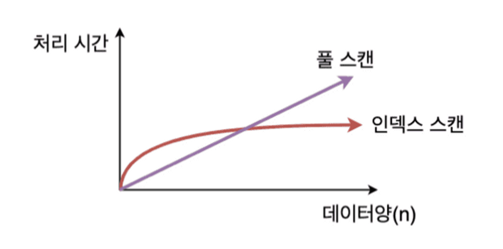

# 인덱스

## 🐣 인덱스란??

:::tip

데이터베이스 테이블에 대한 검색 성능을 높여주는 자료 구조

:::

- 일종의 책 목차
    - 인덱스에서 내가 원하는 데이터를 먼저 찾고 저장되어 있는 물리적 주소로 찾아감

.

## 🐣인덱스 어떻게 동작하는건데??

:::tip

추가적인 쓰기 작업과 저장 공간을 활용

특정 컬럼 인덱스 생성  
→ 해당 컬럼의 데이터(key)들을 오름차순 정렬하여 별도의 메모리 공간에 데이터의 물리적 주소(value)와 함께 (key,value)로 저장됨  
→ 쿼리에 "인덱스 생성 컬럼을 Where 조건으로 거는 등"의 작업을 하면 `옵티마이저`에서 판 생성된 인덱스 사용  
→ 먼저 인덱스에 저장되어 있는 데이터의 물리적 주소로 가서 데이터를 가져오는 식으로 동작 (그림참조)  

:::

- DB관련 작업의 속도저하는 대부분 Select문, 특히 조건검색 Where절
    - index: 가장 우선시 되는 해결책

###### *옵티마이저 

- 가장 효율적인 방법으로 SQL을 수행할 최적의 처리 경로를 생성해주는 DBMS의 핵심 엔진이다.
- 컴퓨터의 두뇌가 CPU인 것처럼 DBMS의 두뇌는 **옵티마이저**라고 할 수 있다.

.

## 🐣 인덱스를 사용하는 이유

:::tip

- 조건검색 Where 절 성능개선
- 정렬 Order by 절 성능개선
- Min, Max 효율적인 처리

⇒ Full Table Scan을 최소화하여 검색을 빠르게 하는 것

:::

- RDBMS에서 인덱스는 필수
    - 일반적으로 데이터 조회 업무가 90프로 이상

### 🥚 조건검색 Where 절 성능개선

인덱스 테이블 스캔시, `데이터들이 정렬`되어 저장되어 있어 해당 조건(WHERE)에 맞는 데이터들을 빠른 탐색

###### 인덱스가 없다면?

- 테이블을 만들고 안에 데이터가 쌓이게 되면 테이블의 레코드는 내부적으로 순서가 없이 뒤죽박죽으로 저장
- → Where절에 특정 조건에 맞는 데이터들을 찾아낼때도 Full Table Scan

### 🥚 정렬 Order by 절 성능개선

인덱스(Index)를 사용하면 `데이터들이 이미 정렬`되어 있어, Order by에 의한 Sort과정을 피할수가 있습니다

###### 인덱스가 없다면?

- Order by는 굉장히 부하가 많이 걸리는 작업
  - 정렬과 동시에 1차적으로 메모리에서 정렬이 이루어지고
  - 메모리보다 큰 작업이 필요하다면 디스크 I/O도 추가적으로 발생됩니다

### 🥚 MIN, MAX의 효율적인 처리가 가능

`데이터가 정렬`되어 있기에 MIN값과 MAX값을 레코드의 시작값과 끝 값 한건씩만 가져오면 됨

- FULL TABE SCAN으로 테이블을 다 뒤져서 작업하는 것보다 훨씬 효율적으로 찾을 수 있습니다

.  

###### *풀 테이블 스캔 (Full Table Scan)

- 레코드의 처음부터 끝까지 다 읽어서 검색 조건과 맞는지 비교
- 가장 느린 Scanning 방법
- 전체 데이터를 읽는 과정에서 많은 자원을 소모
- 특정시점까진 풀테이블 스캔이 빠를 수 있다
    - `Index를 통한 검색`은 B+TREE에서 leaf node까지 찾아 내려가서 해당 데이터를 찾기 위해 디스크로 접근하는 과정을 거침
    - `Full Table Scan`은 B+TREE를 거치지 않고 바로 디스크에서 데이터를 읽어오기 때문입니다.
    - *데이터의 양이 많지 않거나, Index가 효율적으로 설정되어 있지 않은 경우는 오히려 Table Full Scan이 더 빠름*

## 🐣 인덱스의 단점

:::tip

- 인덱스는 DML에 취약 (검색위주의 테이블에 적합)
- 무조건 인덱스가 좋은건 아님
- 인덱스를 많이 만드는 것은 좋지 않다.
  - 사용하지 않는 인덱스 바로 제거해주기!

⇒ SQL 을 효율적으로 짜는것이 먼저! 인덱스는 마지막 수단 느낌

:::

### 🥚 인덱스는 DML에 취약

- INSERT, UPDATE, DELETE가 발생한다면,
    - 인덱스 테이블 내에 있는 값들을 다시 정렬을 해야함
    - 인덱스 테이블, 원본 테이블 이렇게 두 군데의 데이터 수정 작업을 해줘야 함
- 따라서, DML이 빈번한 테이블보다 검색위주의 테이블에 인덱스가 적합

##### 👾 인덱스로 인한 부하 막기
- DML 취약 약점보안: 인덱스는 데이터 삭제라는 개념에서 `인덱스를 사용하지 않는다` 라는 작업으로 이를 대신합니다.
  - INSERT: 새로운 데이터에 대한 인덱스를 추가합니다.
  - DELETE: 삭제하는 데이터의 인덱스를 사용하지 않는다는 작업을 진행합니다.
  - UPDATE: 기존의 인덱스를 사용하지 않음 처리하고, 갱신된 데이터에 대해 인덱스를 추가합니다.

### 🥚 무조건 인덱스 스캔이 좋은 것은 아니다

- 검색시에도 무조건 인덱스가 좋은 것은 아니다.
    - 인덱스는 테이블의 전체 데이터 중에서 `10~15% 이하`의 데이터를 처리하는 경우에만 효율적이고 그 이상의 데이터를 처리할 땐 인덱스를 사용하지 않는 것이 더 낫다.**
    - ex. 직관적인 예시를 들자면 **1개의 데이터가 있는 테이블과 100만 개의 데이터가 들어 있는 테이블이 있다고 하자. 100만 개의 데이터가 들어있는 테이블이라면 풀 스캔보다는 인덱스 스캔이 유리하겠지만, 1개의 데이터가 들어있는 테이블은 굳이 인덱스 스캔 없이 풀 스캔이 빠를 것

### 🥚 인덱스를 많이 만드는 것은 좋지 않다

- 인덱스를 관리하기 위해서는 데이터베이스의 약 10%에 해당하는 저장공간이 추가로 필요
    - 무턱대고 인덱스를 만들어서는 결코 안 된다는 것이다.
    - 즉, 속도 향상에 비해 단점들의 COST를 비교해서 인덱스를 만들지 말지를 정해야 한다.

.

## 🐣 인덱스 언제 적용하면 좋을까??
- 규모가 작지 않은 테이블
- INSERT / UPDATE / DELETE가 자주 발생하지 않는 컬럼
- JOIN / WHERE / ORDER BY에 자주 사용되는 컬럼
- 데이터의 중복도가 낮은 컬럼 (ex. PK)