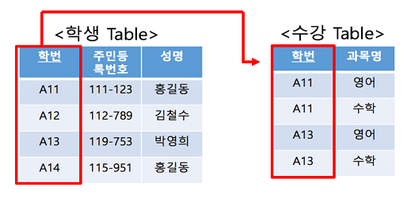

# Key

## 🐣 **키??**
:::tip
식별자
:::
- RDBMS에서 조건에 만족하는 튜플을 찾거나 순서대로 정렬할 때 다른 튜플들과 구별할 수 있는 기준이 되는 Attribute(속성)

> ###### *튜플 : 릴레이션을 구성하는 각각의 행, 속성의 모임으로 구성
> ###### *튜플의 수 = 카디널리티(Cardinality) = 기수 = 대응수

---
## 🐣 **키 종류는?**

### 🥚 **슈퍼 키(Super Key)**
**유일성**을 만족하는 키

- **유일성: 어떤 속성끼리 묶던 중복값이 안나오고 서로 구별**만 할 수 있으면 된다
- ex. {학번 + 이름}, {주민등록번호 + 학번}

### 🥚 **복합 키(Composite Key)**
**2개 이상**의 속성(attribute)을 사용한 키.

### 🥚 **후보 키(Candidate key)**
**유일성**과 **최소성**을 만족하는 키

- **슈퍼키들 중에서 속성을 최소한의 갯수**
- 기본키가 될 수 있는 후보이기 때문에 후보키라고 불린다.
- ex. 주민등록번호, 학번 등

### 🥚 **기본 키(Primary key)**
**후보 키에서 선택된 키**
- NULL 안됨!
- 유일성!
- 최소성!
- 테이블에서 기본키는 **오직 1개**만 지정할 수 있다    

### 🥚 **대체 키(Surrogate key)**
**후보 키 중에 기본 키로 선택되지 않은 키**

- 후보키가 두개 이상일 경우 그 중에서 어느 하나를 **기본키로 지정하고 남은 후보키**들을 대체키라한다    

### 🥚 **외래 키(Foreign Key)**
테이블(Relation) 간의 기본 키(Primary key)를 참조하는 속성

- **참조할(A)열의 값은 참조할(A) 테이블에서 기본키(Primary Key)로 설정**
- `참조 무결성 제약조건`: NULL값이거나 부모테이블의 기본키 값과 동일
  - 외래 키 속성은 참조할 수 없는 값을 지닐 수 없음
- 테이블(Relation)들 간의 관계를 나타내기 위해서 사용

