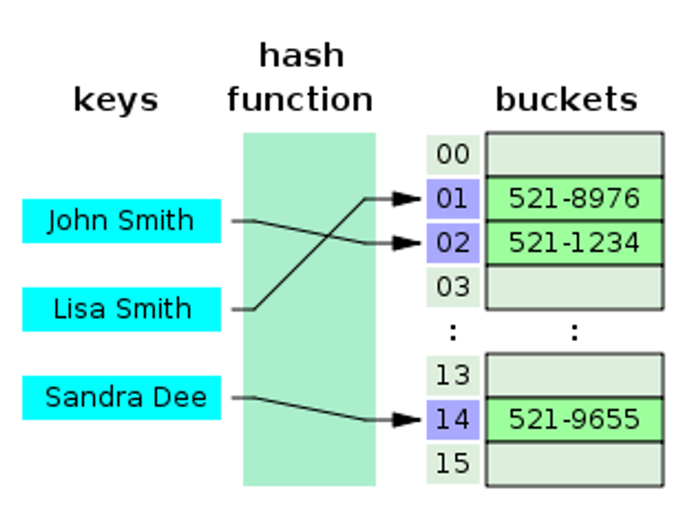
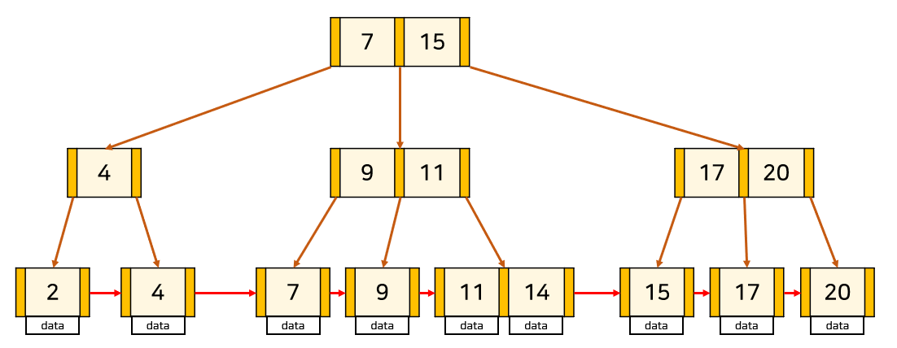
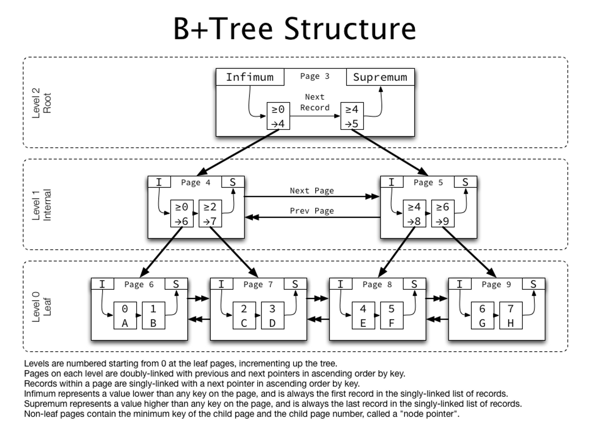

# 인덱스의 자료구조

## 🐣 인덱스는 내부적으로 어떤 자료구조를 써??

:::tip

해시테이블

B+Tree

:::

## 🐣 해시 테이블 (Hash Table)??

- 해시 테이블은 (Key, Value)로 데이터를 저장하는 자료구조
- `O(1)` ****빠른 데이터 검색이 필요할 때 유용
    - 해시 테이블은 Key값을 이용해 고유한 index를 생성하여 그 index에 저장된 값을 꺼내오는 구조이다.

### 🥚 해시 테이블 동작방식

- 특정 컬럼 인덱스 생성
  → 해당 컬럼의 데이터(key)들을 오름차순 정렬하여 별도의 메모리 공간에 데이터의 물리적 주소(value)와 함께 (key,value)로 저장됨
  → 쿼리에 "인덱스 생성 컬럼을 Where 조건으로 거는 등"의 작업을 하면 `옵티마이저`에서 판 생성된 인덱스 사용
  → 먼저 인덱스에 저장되어 있는 데이터의 물리적 주소로 가서 데이터를 가져오는 식으로 동작 (그림참조)

### 🥚해시 테이블을 사용하지 않는 이유

- 해시가 등호(=) 연산에만 특화되었다
- → 해시 함수는 값이 1이라도 달라지면 완전히 다른 해시 값을 생성하는데, 이러한 특성에 의해 부등호 연산(>, <)이 자주 사용되는 데이터베이스 검색을 위해서는 해시 테이블이 적합하지 않다.
    - ex. "나는"으로 시작하는 모든 데이터를 검색하기 위한 쿼리문은 인덱스의 혜택을 전혀 받지 못하게 된다. 이러한 이유로 데이터베이스의 인덱스에서는 B+Tree가 일반적으로 사용된다.

## 🐣 B+ Tree

### 🥚 B-Tree

- B-Tree는 탐색 성능을 높이기 위해 높이를 균형 있게 유지하는 Balanced Tree

  

1. 모든 노드가 (key, value) 를 함께 갖는다 → 풀스캔시 모든 노드를 탐색해야한다
2. node의 key의 수가 k개라면, 자식 node의 수는 k+1개이다.
3. node의 key는 반드시 정렬된 상태여야 한다.
4. 자식 node들의 key는 현재 node의 key를 기준으로 크기 순으로 나뉘게 된다.
5. root node는 항상 2개 이상의 자식 node를 갖는다. (root node가 leaf node인 경우 제외)
6. M차 트리일 때, root node와 leaf node를 제외한 모든 node는 최소 ⌈M2⌉⌈M2⌉, 최대 MM개의 서브 트리를 갖는다.
7. 모든 leaf node들은 같은 level에 있어야 한다.

### 🥚 B+Tree

- DB의 인덱스를 위해 B-Tree를 개선시킨 자료구조
    - 리프노드(`데이터노드`)만 인덱스와 함께 데이터(Value)를 가지고 있고, 나머지 노드(`인덱스노드`)들은 데이터를 위한 인덱스(Key)만을 갖는다.
    - 리프노드들은 LinkedList로 연결되어 있다.
    - 데이터 노드 크기는 인덱스 노드의 크기와 같지 않아도 된다.
- B+Tree는 O(𝑙𝑜𝑔2𝑛log2n)

  

- InnoDB에서의 B+Tree는 일반적인 구조보다 더욱 복잡하게 구현
    - InnoDB에서는 같은 레벨의 노드들끼리는 Linked List가 아닌 Double Linked List로 연결되었으며, 자식 노드들은 Single Linked List로 연결되어 있다.

##### 👾 B+Tree 의 장점

1. leaf node를 제외하고 데이터를 저장하지 않기 때문에 `메모리를 효율`

`하나의 node에 더 많은 포인터를 가질 수 있기 때문에 트리의 높이가 더 낮아지므로 검색 속도를 향상`

2. Full scan을 하는 경우 `leaf node에만 데이터가 저장`되어 있고, `leaf node끼리 linked list로 연결`되어 있기 때문에 `선형 시간이 소모`됨

- 부등호를 이용한 순차검색 효율
- `반면 B-Tree는 모든 node를 확인해야 함`
- `물론 Best Case에 대해 B-Tree는 리프노드까지 가지 않아도 탐색할 수 있는 BTree에 비해 무조건 리프노드까지 가야한다는 단점`

⇒ B+Tree는 O(𝑙𝑜𝑔2𝑛log2n) 시간복잡도를 갖지만 해시테이블보다 인덱싱에 더욱 적합한 자료구조임