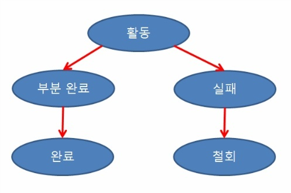

# 트랜잭션
---

## 🐣 트랜잭션(Transaction)??

:::tip

데이터베이스의 상태를 변화시키기 위한 `작업의 논리적 단위`

트랜잭션 작업

- 접근할 테이블 row에 Lock을 걸어두고 작업 (격리수준에 따름)
- `Target 테이블`을 `메모리 버퍼` 위에 올려두고 작업 → 실시간으로 테이블에 반영되지 않고, Rollback가능

:::

- [SQL](../sql/SQL.md)을 이용하여 데이터베이스를 접근 하는 것을 의미한다.
    - DML
    - POSTGRESQL 은 DDL도 커밋을 해야함!
    - 단. SQL 한문장이 아니다 → `작업의 논리적 단위`
- 하나의 트랜잭션은 Commit되거나 Rollback 됨
- 작업단위를 잘 설정하는 것이 중요
- ex. 송금과정 - 하나의 트랜잭션
    - 중간에 문제가 발생하더라도 송금로직 전체 데이터를 한번에 Rollback

##### 👾 DBMS의 성능

- `초당 트랜잭션의 실행 수`(`TPS` : Transaction per second)로 측정

##### 👾 트랜잭션의 범위를 최소화하라!

- 트랜잭션은 꼭 필요한 최소의 코드에만 적용해!
- 왜냐면 `데이터베이스 커넥션은 개수`가 한정되어 있음  
  → 각 단위프로그램이 커넥션을 소유하는 시간이 길어지면 유휴커넥션의 개수가 줄어듬  
  → 커넥션부족으로 프로그램이 대기하는 상황 발생  
  → 성능저하  

.

## 🐣 ACID: 데이터베이스 4가지 성질??

:::tip

데이터의 [무결성](../rdbms/Integrity.md)을 위한 DBMS의 트랜잭션 성질

ACID

- 원자성 (Atomicity)
- 일관성 (Consistency)
- 독립성 (Isolation)
- 지속성 (Durability)

:::

### 🥚 원자성 (Atomicity)

:::tip

트랜잭션의 연산은 DBMS에 모두 반영(Commit)되든지, 전혀 반영되지 않아(Rollback)야 함

:::

- 트랜잭션의 일부만 수행할 수는 없음
- 트랜잭션 내의 모든 명령은 반드시 완벽히 수행되어야 하며, 모두가 완벽히 수행되지 않고 어느하나라도 오류가 발생하면 트랜잭션 전부가 취소되어야 한다.

### 🥚 일관성 (Consistency)

:::tip

트랜잭션은 트랜잭션 전후로 일관성 있는 DBMS 상태(`Correct State`)를 유지해야 함

:::

##### 👾 Correct State

- 도메인의 유효범위, 무결성 제약조건 등의 규칙이나 제약조건을 위배하지 않는 정상적인 상태

### 🥚 독립성, 격리성 (Isolation)

:::tip

각각의 트랜잭션은 서로 간섭 없이 독립적으로 수행되어야 함

:::

- 각각의 트랜잭션이 동시에 병행 실행되는 경우, 하나의 트랜잭션 실행중에 다른 트랜잭션 연산이 끼어들 수 없음
- 수행중인 트랜잭션이 완전히 완료될 때까지 다른 트랜잭션에서 수행 결과를 참조할 수 없다.
- 트랜젝션은 원자성, 일관성, 지속성을 보장. 하지만 격리성은 SERIALABLE 격리수준일때만 보장
    - [👾 격리성이 위반되었을때 발생할 수 있는 문제](./IsolationProblem.md)
    - 동시성 처리 성능 이슈로, [트랜잭션 격리수준](./IsolationLevel.md)을 나눠 Optional하게 적용

### 🥚 영속성, 지속성 (Durablility)

:::tip

성공적으로 수행된 트랜잭션은 영구적으로 기록

- 중간에 시스템 문제가 발생했을때 데이터베이스 로그를 참고해서 성공했던 트랜잭션을 복구가능

:::

.

## 🐣 트랜잭션의 Commit, Rollback 연산

### 🥚 COMMIT

:::tip

- 트랜잭션의 모든 작업을 정상처리 (성공적으로 종료)
    - 트랜잭션이 로그파일 (.ldf)에 트랜잭션 저장 → Rollback 시 이용
    - 트랜잭션 결과를 DBMS에 반영 (영구저장) → 모든 사용자가 변경한 데이터의 결과 조회가능
    - COMMIT 되고 나면 이전 데이터 복구가 어려움

:::

##### 👾 auto-commit
- DB 기본 설정에서 자동으로 commit을 해주는 옵션

### 🥚 ROLLBACK

:::tip

- 트랜잭션 과정에서 하나라도 문제가 발생하면, 작업을 `원복`하고, 트랜잭션을 재시작하거나, 폐기
    - 원복은 SAVEPOINT / 없다면 이전 COMMIT
    - 관련된 row에 Lock이 풀림 → 다른 트랜잭션이 데이터 접근 가능

:::

#### 👾 롤백 세그먼트 (ROLLBACK SEGMENT)

- 트랜잭션 작업중, 현재까지의 성공적인 상태를 이미지로 기록하기 위한 CIRCULAR 구조의 세그먼트
    - 행을 변경할 때, 변경되기 전의 파일, 블록 ID같은 블럭 정보 및 데이터를 저장
    - 롤백 세그먼트의 헤더는 현재 세그먼트를 사용하고 있는 트랜잭션에 대한 정보를 저장하는 있는 트랜잭션 테이블을 포함
    - 트랜잭션이 시작하려면 반드시 롤백 세그먼트가 있어야 합니다.
    - 트랜잭션은 단 하나의 롤백 세그먼트에 롤백(실행 취소) 기록 전부를 기록합니다.
    - 많은 트랜잭션이 동시에 하나의 롤백 세그먼트에 쓰기를 할 수 있습니다.
- ROLLBACK시 롤백 세그먼트내의 상태가 복구
- COMMIT시 롤백 세그먼트의 롤백이미지 초기화

#### 👾 SAVEPOINT

- ROLLBACK시, 트랜잭션 작업의 일부만 원복 가능하도록 SAVEPOINT 지정 (일종의 사용자 지정 세부작업단위)
- 다수의 SAVEPOINT 지정가능
    - 동일한 이름일때는 덮어쓰기
- COMMIT 하면, COMMIT 이전에 만든 SAVEPOINT 모두 소멸
- 그림에서  SP1으로 롤백을 한 뒤에는 미래 시점인 SP2의 savePoint는 삭제 됨

## 🐣 트랜잭션의 상태

:::tip

- 활동(Active) : 트랜잭션이 실행중인 상태
- 실패(Failed) : 트랜잭션 실행에 오류가 발생하여 중단된 상태
- 철회(Aborted) : 트랜잭션이 비정상적으로 종료되어 Rollback 연산을 수행한 상태
- 부분 완료(Partially Committed) : 트랜잭션의 마지막 연산까지 실행했지만, Commit 연산이 실행되기 직전의 상태 (COMMIT 요청만 들어온 상태)
- 완료(Committed) : 트랜잭션이 성공적으로 종료되어 Commit 연산을 실행한 후의 상태

:::

##### 👾 **부분완료 vs 완료**
- COMMIT 요청 → 부분완료
- COMMIT 정상처리 → 완료
- COMMIT 실패 → 실패

---
### Reference

https://d2.naver.com/helloworld/407507